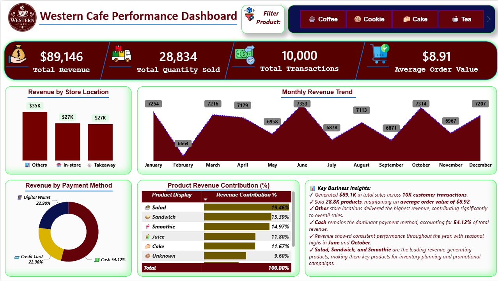

# ☕ Western Cafe Performance Dashboard

> **End-to-End Data Analytics Project using Microsoft Excel, PostgreSQL, SQL & Power BI**

---

## 📌 Project Overview

The **Western Cafe Performance Dashboard** is an end-to-end Data Analytics project that transforms raw café sales data into meaningful business insights.

The project demonstrates the complete analytics lifecycle—from **data cleaning and transformation** to **SQL analysis**, **KPI development**, and an **interactive Power BI dashboard**.

---

## 🎯 Objectives

- Clean and prepare raw sales data
- Perform business analysis using SQL
- Develop business KPIs
- Build an interactive Power BI dashboard
- Generate actionable business insights

---

## 🛠️ Tech Stack

| Tool | Purpose |
|------|---------|
| Microsoft Excel | Raw Dataset |
| PostgreSQL | Database |
| SQL | Data Cleaning & Analysis |
| Power BI | Dashboard & Visualization |
| DAX | KPI Calculations |
| Power Query | Data Transformation |

---

## 🔄 End-to-End Workflow

```text
Raw Dataset (Excel)
        │
        ▼
Data Cleaning (SQL)
        │
        ▼
Data Transformation
        │
        ▼
Business Analysis
        │
        ▼
KPI Development (DAX)
        │
        ▼
Interactive Power BI Dashboard
        │
        ▼
Business Insights
```

---

## 📂 Repository Structure

```text
Western-Cafe-Performance-Dashboard
├── Dataset
├── SQL
├── Power BI
├── Images
└── README.md
```

---

## 📊 Dashboard KPIs

- 💰 Total Revenue
- 📦 Total Quantity Sold
- 🧾 Total Transactions
- 🛒 Average Order Value

## 📈 Dashboard Features

- Revenue by Store Location
- Monthly Revenue Trend
- Revenue by Payment Method
- Product Revenue Contribution
- Interactive Product Slicer
- Executive Business Insights

---

## 🧹 Data Cleaning

- Removed duplicate records
- Handled missing values
- Standardized inconsistent values
- Corrected data types
- Created analysis-ready dataset

---

## 🧠 SQL Concepts Used

- CTEs
- Window Functions
- Aggregate Functions
- CASE WHEN
- GROUP BY & HAVING
- Ranking Functions
- Date Functions
- Percentage Calculations

---

## 📌 Key Business Insights

- Generated **$89.1K** in revenue across **10K** customer transactions.
- Sold **28.8K** products with an average order value of **$8.91**.
- **Cash** contributed **54.12%** of total revenue.
- **Other** store locations generated the highest revenue.
- Revenue peaked during **June** and **October**.
- **Salad, Sandwich, and Smoothie** were the top-performing products.

---

## 🖼️ Dashboard Preview

Replace this with:

<h2>🖼️ Dashboard Preview</h2>

<p align="center">
  
</p>
## 🚀 Skills Demonstrated

- SQL
- PostgreSQL
- Power BI
- DAX
- Excel
- Data Cleaning
- Data Analysis
- Dashboard Design
- Business Intelligence
# 📊 Sample SQL Queries

## 1️⃣ Total Revenue

```sql
SELECT
    SUM(total_spent) AS total_revenue
FROM clean_cafe_sales_data;
```

### Result

| Total Revenue |
|--------------:|
| $89,146 |

---

## 2️⃣ Top 5 Revenue-Generating Products

```sql
SELECT
    item,
    SUM(total_spent) AS total_revenue
FROM clean_cafe_sales_data
GROUP BY item
ORDER BY total_revenue DESC
LIMIT 5;
```

### Result

| Product | Revenue |
|---------|---------:|
| Salad | $17,348 |
| Sandwich | $13,715 |
| Smoothie | $13,347 |
| Juice | $10,521 |
| Cake | $10,402 |

---

## 3️⃣ Revenue by Store Location

```sql
SELECT
    store_location,
    SUM(total_spent) AS revenue
FROM clean_cafe_sales_data
GROUP BY store_location
ORDER BY revenue DESC;
```

### Result

| Store Location | Revenue |
|---------------|---------:|
| Others | $35,000 |
| In-store | $27,000 |
| Takeaway | $27,000 |

---

## 4️⃣ Revenue by Payment Method

```sql
SELECT
    payment_method,
    SUM(total_spent) AS revenue
FROM clean_cafe_sales_data
GROUP BY payment_method
ORDER BY revenue DESC;
```

### Result

| Payment Method | Revenue |
|---------------|---------:|
| Cash | $48,249 |
| Credit Card | $20,489 |
| Digital Wallet | $20,408 |

---

## 5️⃣ Product Revenue Contribution

```sql
SELECT
    item,
    ROUND(
        SUM(total_spent)*100.0/
        SUM(SUM(total_spent)) OVER(),2
    ) AS revenue_contribution_pct
FROM clean_cafe_sales_data
GROUP BY item
ORDER BY revenue_contribution_pct DESC;
```

### Result

| Product | Contribution |
|---------|-------------:|
| Salad | 19.46% |
| Sandwich | 15.39% |
| Smoothie | 14.97% |
| Juice | 11.80% |
| Cake | 11.67% |

---

# 📌 Key Business Insights

- Generated **$89.1K** in revenue across **10K** customer transactions.
- Sold **28.8K** products with an average order value of **$8.91**.
- **Cash** contributed **54.12%** of total revenue.
- **Other** store locations generated the highest revenue.
- Revenue peaked during **June** and **October**.
- **Salad, Sandwich, and Smoothie** were the highest revenue-generating products.

---

# 🚀 Skills Demonstrated

- SQL
- PostgreSQL
- Microsoft Excel
- Power BI
- DAX
- Data Cleaning
- Data Analysis
- Dashboard Design
- Business Intelligence
- Data Visualization
- Data Storytelling

---

# 📈 Future Enhancements

- Profit Analysis
- Customer Segmentation
- Sales Forecasting
- Inventory Dashboard
- Time Intelligence Dashboard

---

# 👨‍💻 Author

**Ganesh Kurmi**

⭐ **If you found this project helpful, please consider giving it a Star!**
